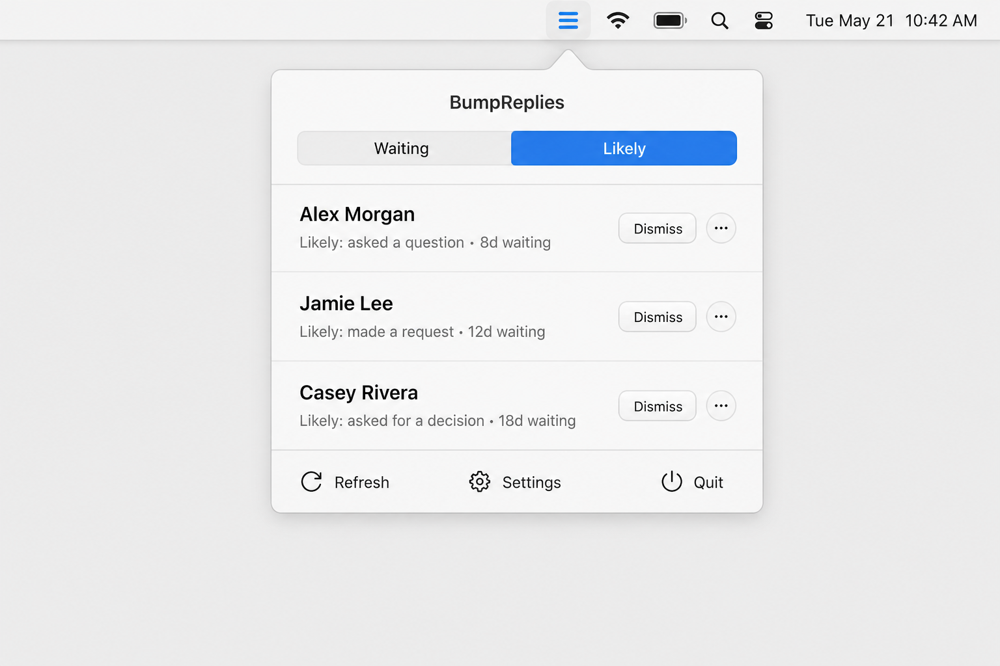
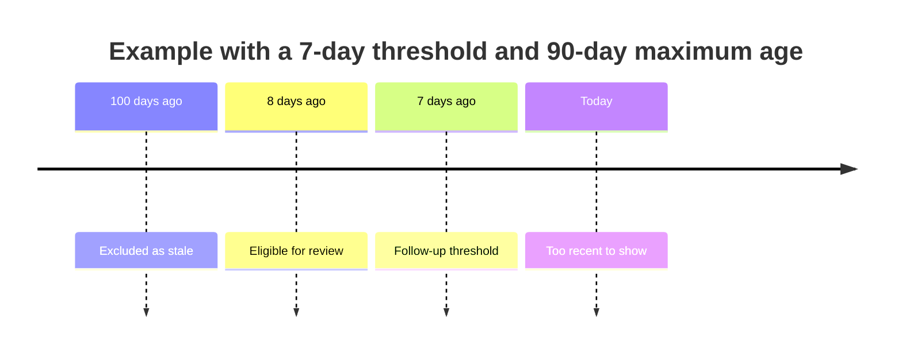

# BumpReplies

> A private, local-first macOS menu-bar app for spotting one-to-one Messages conversations that may need a follow-up.

**Your messages stay on your Mac.** BumpReplies has no backend, networking, telemetry, or analytics.



*Illustrative mockup using fictional names and conversation metadata only.*

| Follow up with confidence | Keep your queue tidy | Stay private |
| --- | --- | --- |
| Finds conversations waiting on someone else | Dismiss a message or ignore a conversation | Reads Messages locally and in read-only mode |

## At a glance

| Feature | What it helps with |
| --- | --- |
| **Waiting** | Finds older conversations where your latest message has not received a normal reply. |
| **Ghosting** | Shows the inverse: conversations where the other person has been waiting on you. |
| **Likely / All** | Prioritizes messages with simple reply signals, while keeping every eligible chat available under **All**. |
| **Dismiss and ignore** | Remove one message from the queue or hide an entire conversation until you unignore it. |
| **Notifications** | Optionally receive local notifications for follow-ups. |
| **Contact names** | Optionally resolve familiar names from your local Contacts database. |

## How it works

For each one-to-one chat, BumpReplies looks at its latest non-reaction message. If it is yours, the chat can appear in **Waiting**; if it is theirs, it can appear in **Ghosting**—once the message is older than your chosen threshold.

Reactions do not replace the latest message. By default, a newer reaction from the other person is treated as an acknowledgement; you can change that in Settings. Group chats, dismissed messages, and ignored conversations stay out of the queue.

## Likely follow-ups

**Likely** is a lightweight local ranking, not a stricter definition of a pending conversation. Every eligible conversation is still visible under **All**.

| Signal in the latest message | Example | Shown as |
| --- | --- | --- |
| A question | “Are you free Thursday?” | Likely — asked a question |
| A direct request | “Can you send me the deck?” | Likely — made a request |
| A request for a decision | “Should we meet next week?” | Likely — asked for a decision |
| An acknowledgement or no clear signal | “Sounds good, thanks!” | Review — available under **All** |

Only the latest eligible message is checked, transiently and on your Mac. Its text is never saved or transmitted.

## Choose your window



- **Follow up after** sets the minimum age of the latest message.
- **Ignore conversations older than** sets the maximum age. Older conversations are excluded as stale.

## Get started

1. Open [BumpReplies.xcodeproj](BumpReplies/BumpReplies.xcodeproj) in Xcode and run the **BumpReplies** scheme.
2. Give the development app **Full Disk Access** in **System Settings → Privacy & Security**.
3. Open the menu-bar item and select **Refresh**.
4. Review **Waiting** for chats awaiting someone else, or **Ghosting** for chats awaiting you.

## Private by design

| BumpReplies does | BumpReplies never does |
| --- | --- |
| Reads the local Messages database in read-only mode | Sends messages, metadata, or identifiers off your Mac |
| Uses latest-message text transiently for the optional likelihood ranking | Stores or logs message text |
| Optionally looks up names in local Contacts | Uses a backend, telemetry, analytics, or cloud service |

Read the full policy in [PRIVACY.md](PRIVACY.md).

## Develop and test

Run the unit tests:

```sh
xcodebuild test \
  -project BumpReplies/BumpReplies.xcodeproj \
  -scheme BumpReplies \
  -destination 'platform=macOS,arch=arm64' \
  -only-testing:BumpRepliesTests
```

## Open issues

<!-- open-issues:start -->
| Issue | Title | Labels |
| --- | --- | --- |
| [#1](https://github.com/LooseEndsLab/Bump-Replies/issues/1) | TODO: publish/package | — |
| [#2](https://github.com/LooseEndsLab/Bump-Replies/issues/2) | Tune Likely follow-up rules from real-world feedback | — |
| [#3](https://github.com/LooseEndsLab/Bump-Replies/issues/3) | Add a queue review tab | — |
<!-- open-issues:end -->
